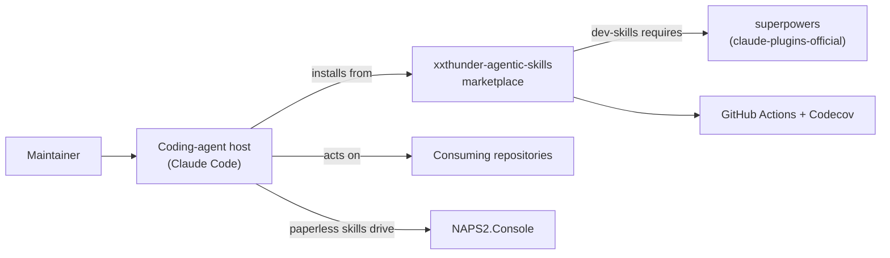
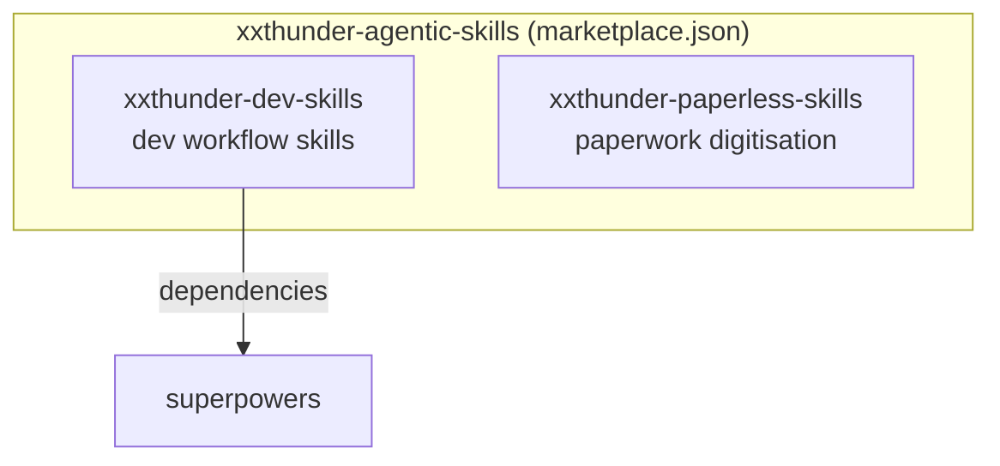
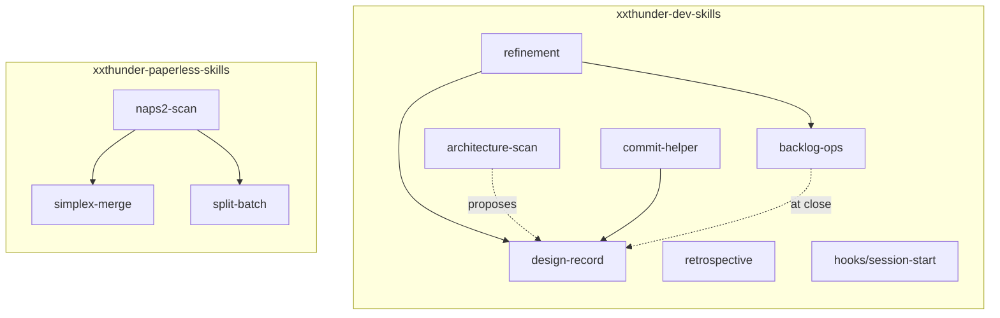
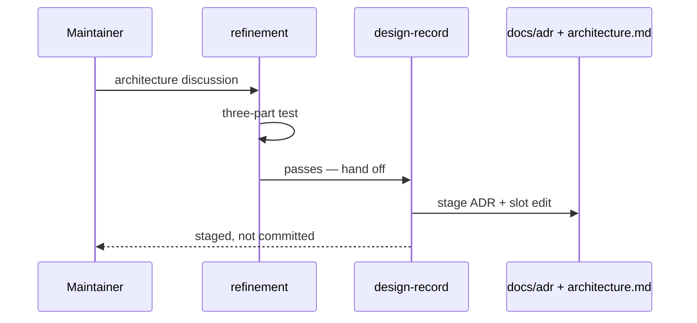

# Architecture

## Purpose

A marketplace of agentic skill plugins. It hosts plugins that extend coding
agents with reusable skills, distributed through the agent's own plugin system
rather than copied between repositories. Claude Code is the current target;
additional agent targets are planned.

## System context

A maintainer works through a coding-agent host. The host installs plugins from
this marketplace and acts on a consuming repository. `xxthunder-dev-skills`
declares a hard dependency on `superpowers`, which lives in a different
marketplace. The paperwork skills drive NAPS2.Console locally. CI runs on
GitHub Actions with coverage reported to Codecov.

## Containers

Two independently installable units, each versioned on its own line.

A user may install either without the other. `xxthunder-dev-skills` pulls in
`superpowers` automatically; `xxthunder-paperless-skills` has no dependencies.

The `pyproject.toml` and `tests/` harness is deliberately **not** a container.
It sets `package = false` and ships to nobody — it exists so `uv run pytest`
can exercise the plugin helper scripts and the hook.

## Components

**`xxthunder-dev-skills`** — six skills, all markdown, plus the only
executable code the plugin ships: a `SessionStart` hook under `hooks/`
(`hooks.json`, an extensionless `session-start`, and a polyglot `run-hook.cmd`
that locates a bash on Windows).

Five skills carry a `references/` file. Two of those are load-bearing beyond
their own skill: `design-record`'s `adr-format.md` and `refinement`'s
`backlog-format.md` state rules that other components read rather than restate,
which is why a rule lives in exactly one of them.

`refinement` and `retrospective` are conversation skills; `backlog-ops` is
mechanics-only; `design-record` is the sole writer of the record;
`architecture-scan` is read-only and proposes into it; `commit-helper` sits at
the boundary of a change.

**`xxthunder-paperless-skills`** — three skills carrying eight PEP 723 helper
scripts run via `uv run`: `naps2-scan` (3 scripts), `simplex-merge` (1),
`split-batch` (4). This is the bulk of the repository's executable code, but no
longer all of it: the `SessionStart` hook above is shell, and `tests/` is split
`tests/paperless/` for the helper scripts, `tests/dev/` for the hook and the
ADR-log invariants.

## Key flows

### Recording a design decision

A decision failing the three-part test stays in the backlog item's
`Scope Decisions` and never reaches the ADR log.

`backlog-ops` is the fourth route in. When completing an item it re-reads the
`Description` and `Scope Decisions`, applies the same three-part test, and
offers a hand-off for anything still binding that is sitting inside. Closing is the
last moment that lift can happen, because nothing keeps a closed item current.

### Bootstrapping or auditing the architecture

`architecture-scan` derives structure from directories, manifests, entry points
and dependency edges, then reports — a bootstrap proposal against an empty
document, a drift report against a populated one. It never writes; approved
output is applied by `design-record`.

### Backlog lifecycle

`refinement` authors items; `backlog-ops` performs every status mutation and
keeps the README table of contents and the epic cascade consistent;
`commit-helper` invokes it at commit boundaries.
Neither authors content.

### Session orientation

The `SessionStart` hook fires on `startup|clear|compact`, discovers which record
artifacts exist in the current repository, and injects their locations. It is
silent in repositories that use none of these conventions.

### Digitising paperwork

`naps2-scan` drives NAPS2.Console with OCR, then chains into `simplex-merge`
for double-sided documents scanned on a simplex scanner, or `split-batch` to
divide a multi-document batch.

## Glossary

Only three terms in this repository carry explicit definitions, all in
[the backlog conventions](backlog/README.md):

- **Epic** — a top-level item with at least one letter-suffixed substory.
  Emergent, not a type field.
- **Substory** — a letter-suffixed child (`XAS-027a`); the suffix encodes the
  parent, so no back-reference is stored.
- **ID prefix** — the per-repository item prefix (`XAS` here), discovered from
  the backlog README rather than configured.

## Decisions

Recorded as ADRs — see [docs/adr/README.md](adr/README.md).
